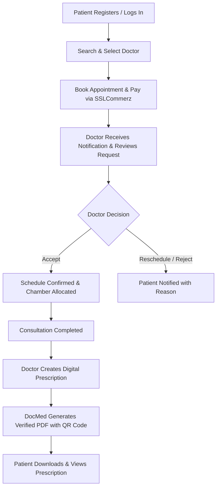

# 🩺 DocMed — Smart Online Prescription & Medical Management Platform

[](https://www.python.org/)
[](https://flask.palletsprojects.com/)
[](https://ai.google.dev/)
[](https://weasyprint.org/)
[](https://sslcommerz.com/)

**DocMed** is a full-featured, AI-powered healthcare management web application built with **Flask**, **SQLAlchemy**, **WeasyPrint**, and **Google Gemini AI**. It connects doctors and patients into a seamless ecosystem for appointments, automated billing, verified digital prescriptions, and intelligent medical assistance.

---

## 🌟 Key Features

### 👨‍⚕️ 1. For Doctors
- **Professional Profile Setup**: Add academic degrees, credentials, government registration numbers, chamber info, consultation fees, and digital signatures.
- **Smart Appointment Management**: Accept, reschedule, confirm, or reject patient booking requests with personalized instructions and chambers.
- **Dynamic Prescription Generator**:
  - Auto-fills patient details and vitals (Blood Pressure, Pulse, SpO2, Temperature, Chief Complaints, Investigations).
  - Prescribes structured medication regimens (Rx) and doctor advice.
  - Automatically incorporates doctor's digital signature and generates a QR code verification stamp.
  - Generates high-fidelity, printable **PDF Prescriptions** rendered through **WeasyPrint** and **ReportLab**.
- **Income & Financial Analytics**: Track consultation earnings, transaction history, and paid consultations.

### 🧑‍💼 2. For Patients
- **Doctor Search & Directory**: Find verified doctors by name, specialty, degree, institution, or consultation fee.
- **Online Appointment Booking**: Select preferred dates/times and provide reason for consultation.
- **Integrated Payment Gateway (SSLCommerz)**: Secure payment for appointment fees supporting Credit/Debit Cards, Mobile Banking (bKash, Nagad, Rocket), and Internet Banking.
- **Prescription & Health History**: Access and download all historical digital prescriptions in PDF format anytime.
- **Real-time Notifications**: In-app notifications for appointment status changes, confirmations, and payments.

### 🤖 3. AI Health Assistant (Powered by Google Gemini)
- **Role-Aware Chatbot**:
  - **For Doctors**: Medical reference assistance, clinical drafting, differential diagnosis suggestions, drug interactions, and automated appointment insights.
  - **For Patients**: Symptom guidance, doctor recommendations, medicine reminders, and appointment scheduling support.
- **Multi-Model Fallback & Key Rotation**: Resilience against rate limits with automatic switching across multiple Gemini models and API keys.
- **Function Calling & Tool Execution**: AI can query appointments, doctor profiles, and account context directly within the conversation.

### 🛡️ 4. Administration & Security
- **Role-Based Access Control (RBAC)**: Distinct permissions for `admin`, `doctor`, and `patient`.
- **Doctor Verification Workflow**: Admins review and verify doctor credentials before they can practice on the platform.
- **Flask-Admin Dashboard**: Comprehensive database management interface for users, appointments, transactions, and logs.
- **Authentication**: Secure password hashing with Werkzeug, CSRF protection with Flask-WTF, and email verification with Flask-Mailman.

---

## 🏗️ Architecture & Tech Stack

- **Backend**: Python 3.12+, Flask 3.1.3
- **Database & ORM**: SQLite (Development) / PostgreSQL (Production) via SQLAlchemy & Flask-Migrate (Alembic)
- **AI / LLM**: Google GenAI SDK (`google-genai`) with Gemini multi-model fallback & function calling
- **PDF Generation**: WeasyPrint, ReportLab, Cairo, Pango, pyHanko
- **Payment Processing**: SSLCommerz Payment Gateway (Sandbox & Live)
- **Email Service**: Flask-Mailman (SMTP / Gmail integration)
- **Packaging & Environment**: `uv` package manager, Gunicorn, Docker

---

## 📂 Project Structure

```text
DocMed-Online-Prescription-Generator/
├── app/
│   ├── config.py              # Configuration environments (Dev, Prod, Test)
│   ├── extensions.py          # Flask extensions (db, migrate, mail, login)
│   ├── core/                  # Core admin interface & utilities
│   ├── modules/
│   │   ├── account/           # Authentication, profile, registration, & user models
│   │   ├── ai/                # Gemini AI service, prompts, tools & chat routes
│   │   ├── dashboard/         # Doctor & patient dashboards, appointments, payments
│   │   ├── home/              # Landing page & public navigation
│   │   ├── pdf/               # Prescription builder, PDF renderers & QR generator
│   │   └── search/            # Doctor search & filter endpoints
│   ├── static/                # CSS, JavaScript, icons, signatures & uploaded assets
│   └── templates/             # Jinja2 templates & UI components
├── migrations/                # Alembic database migration scripts
├── Dockerfile                 # Multi-stage production container configuration
├── manage.py                  # App entry point & CLI commands (e.g. createsuperuser)
├── pyproject.toml             # Project dependencies and packaging
├── uv.lock                    # Dependency lockfile
└── render.yaml                # Render deployment blueprint
```

---

## 🚀 Getting Started

### Prerequisites
- **Python 3.12+**
- **[uv](https://github.com/astral-sh/uv)** (Recommended) or `pip`
- **WeasyPrint System Dependencies**:
  - *Windows*: MSYS2 MinGW64 / GTK3 libraries (Pango, Cairo)
  - *Linux (Ubuntu/Debian)*: `sudo apt-get install libpango-1.0-0 libpangocairo-1.0-0 libcairo2 libgdk-pixbuf-2.0-0 libffi-dev fonts-liberation`
  - *macOS*: `brew install pango cairo libffi`

---

### Installation Steps

1. **Clone the repository**:
   ```bash
   git clone https://github.com/Senpaioka/DocMed-Online-Prescription-Generator.git
   cd DocMed-Online-Prescription-Generator
   ```

2. **Set up the virtual environment & install dependencies**:
   ```bash
   # Using uv (fastest)
   uv sync

   # Or using standard pip
   python -m venv .venv
   source .venv/bin/activate  # On Windows: .venv\Scripts\activate
   pip install -r requirements.txt
   ```

3. **Configure Environment Variables**:
   Create a `.env` file in the project root:
   ```env
   WTF_CSRF_SECRET_KEY=your_secret_key_here
   DATABASE_URL=sqlite:///app.db
   DEBUG=True

   # Mail settings (Flask-Mailman)
   MAIL_SERVER=smtp.gmail.com
   MAIL_PORT=587
   MAIL_USE_TLS=True
   MAIL_USERNAME=your_email@gmail.com
   MAIL_PASSWORD=your_app_password

   # SSLCommerz Payment Gateway
   SSLCOMMERZ_STORE_ID=your_store_id
   SSLCOMMERZ_STORE_PASSWORD=your_store_password
   SSLCOMMERZ_IS_SANDBOX=True

   # Google Gemini AI
   GEMINI_API_KEY=your_gemini_api_key
   # Optional comma-separated backup keys for rotation:
   GEMINI_API_KEYS=key1,key2
   GEMINI_MODEL=gemini-2.5-flash
   ```

4. **Initialize Database Migrations**:
   ```bash
   uv run flask db upgrade
   ```

5. **Create an Admin Superuser**:
   ```bash
   uv run python manage.py createsuperuser
   ```

6. **Run the Development Server**:
   ```bash
   uv run python manage.py
   # Or using flask
   uv run flask run --debug --port 5000
   ```
   Open [http://localhost:5000](http://localhost:5000) in your browser.

---

## ⚙️ How It Works (Workflow Overview)



1. **Patient Search & Appointment**: The patient searches for a doctor and requests an appointment.
2. **Payment & Verification**: The appointment fee is processed via SSLCommerz. Once validated, status transitions to `paid`.
3. **Doctor Review & Confirmation**: The doctor reviews patient details, approves the schedule, and adds consultation notes.
4. **Prescription Generation**: Following the consultation, the doctor fills out the prescription form. DocMed embeds vitals, Rx directives, and digital signature into a secure, downloadable PDF with a verification QR code.
5. **AI Companion**: At any point, doctors or patients can chat with the built-in Gemini AI assistant for medical advice, prescription explanations, or appointment management.

---

## 🐳 Docker Deployment

To build and run the application with Docker:

```bash
# Build Docker image
docker build -t docmed-app .

# Run container
docker run -d -p 5000:5000 --env-file .env docmed-app
```

---

## 📄 License

This project is licensed under the [MIT License](LICENSE).
